# CME markdown transformation gap report

This report compares conex against `Spenhouet/confluence-markdown-exporter` (CME) from the narrow perspective of Markdown transformation fidelity.

CME is a broad Confluence-to-Markdown migration tool. Conex should not copy its entire CLI/config/export surface; the useful benchmark is the transformation behavior that makes exported Markdown render correctly in GitHub, Obsidian, ADO, and similar readers.

## Summary

| Area | Status in this branch | Why CME is/was better |
|---|---|---|
| Rendered `` emoji | Fixed + tested | CME handled rendered Confluence emoji images; conex previously focused on storage `<ac:emoticon>` tags. |
| Unicode whitespace inside inline formatting | Fixed + tested | CME normalizes `&nbsp;`, EM SPACE, THIN SPACE before markdown conversion so `word<em>&nbsp;text</em>` does not collapse into `word*text*`. |
| Template placeholder escaping | Fixed + tested | CME escapes text placeholders like `<TOPIC>` / `<medical device>` so Obsidian does not treat them as unknown HTML tags. |
| Fragment anchor normalization | Fixed + tested | CME converts Confluence anchors such as `#1.-Request-Service` to GitHub-style `#1-request-service`. |
| PlantUML macro JSON → fenced block | Fixed for storage XML + tested | CME supports PlantUML and emits fenced `plantuml` blocks. Conex now supports the storage-XML form it normally receives. |
| Wiki-style links | Gap, xfailed test | CME can generate `[[Page Title]]`/`[[#Heading]]` links via config; conex has no link-style configuration. |
| Rendered-HTML PlantUML lookup via `editor2` | Gap, xfailed test | CME can resolve rendered `<div data-macro-name="plantuml" data-macro-id="...">` back to `page.editor2`; conex currently consumes storage XML directly. |
| Target-specific page/attachment path/link templates | Not ported | CME has rich config for Obsidian/ADO/relative/absolute/wiki paths. Conex intentionally keeps its page-directory + `.media/` layout. |
| Jira enrichment | Not ported | CME can enrich Jira issue links with Jira metadata; conex currently renders Jira macros as issue keys. |
| Confluence Server/Data Center rendered quirks | Not ported | CME supports more URL/API modes and rendered HTML cases. Conex is Confluence Cloud/storage-XML oriented today. |

## Tests added

`tests/test_cme_transform_parity.py` ports the transformation-focused CME tests from:

- `tests/unit/test_emoticon_conversion.py`
- `tests/unit/test_nbsp_fix.py`
- `tests/unit/test_template_placeholders.py`
- `tests/unit/test_confluence.py::TestAnchorLinkConversion`
- `tests/unit/test_plantuml_conversion.py`

The suite adapts CME's `Page.Converter.convert(html)` style to conex's pipeline:

1. `_preprocess_html(html, attachments)`
2. `markdownify(...)`
3. conex post-processing helpers

## Fixed in this branch

### 1. Rendered emoji images

Added support for rendered Confluence emoji images such as:

```html

```

Resolution order follows CME: direct Unicode fallback, hex codepoint ID, Atlassian ID map, shortname fallback.

### 2. Unicode whitespace preservation

Added `_normalize_unicode_whitespace()` and apply it to text nodes outside `<pre>` before markdownify. This preserves spacing around inline formatting while leaving normal newlines/tabs alone.

### 3. Template placeholder escaping

Added `_escape_template_placeholders()` post-processing. It escapes likely placeholders while preserving real HTML tags and anything inside inline/fenced code.

Examples:

```markdown
<TOPIC>                 → \<TOPIC\>
<medical device>        → \<medical device\>
text<br/>more text      → text<br/>more text
Use `<TOPIC>` here      → unchanged inside inline code
```

### 4. Anchor normalization

Added `_normalize_anchor_links()` post-processing for fragment-only links.

```markdown
[request service](#1.-Request-Service) → [request service](#1-request-service)
```

### 5. PlantUML storage macro conversion

Added `_convert_plantuml()` for storage XML:

```xml
<ac:structured-macro ac:name="plantuml">
  <ac:plain-text-body><![CDATA[{"umlDefinition":"@startuml\n...\n@enduml"}]]></ac:plain-text-body>
</ac:structured-macro>
```

It emits:

````markdown

```plantuml
@startuml
...
@enduml
```

````

Invalid/missing content emits an HTML comment instead of silently dropping the macro.

## Gaps intentionally left open

### Wiki-style links

CME can output wiki links for Obsidian:

```markdown
[[Page Title]]
![[image.png|alt text]]
[[#Heading]]
```

Conex currently has a fixed LLM-ready markdown style and no `page_href` / `attachment_href` config. Adding this would be a product decision, not a small converter parity fix.

### Rendered-HTML PlantUML via `editor2`

CME can take rendered HTML like:

```html
<div data-macro-name="plantuml" data-macro-id="abc"></div>
```

and look up the actual PlantUML JSON in a separate `page.editor2` XML field. Conex normally fetches storage XML, where the macro body is inline, so adding this would require carrying an additional rendered/editor2 representation through the data model.

### Target-specific path/link templates

CME has configurable page and attachment path templates plus relative/absolute/wiki href modes. Conex's current differentiated value is the stable page-as-directory tree:

```text
Page/
  Page.md
  .media/
  .workspace/
```

That should remain the default. If compatibility export modes become important, add them explicitly rather than weakening the LLM/workspace layout.

## Recommendation

Keep using CME as the transformation-fidelity benchmark. Conex should selectively absorb small, robust conversion fixes like the ones above, but stay focused on the agent/workbench model: frontmatter, page-tree directories, `.media/`, `.workspace/`, git versioning, and diff/re-export loops.
